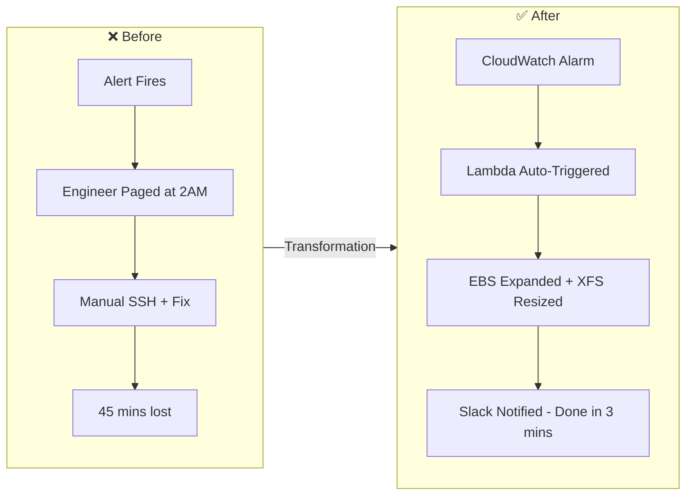
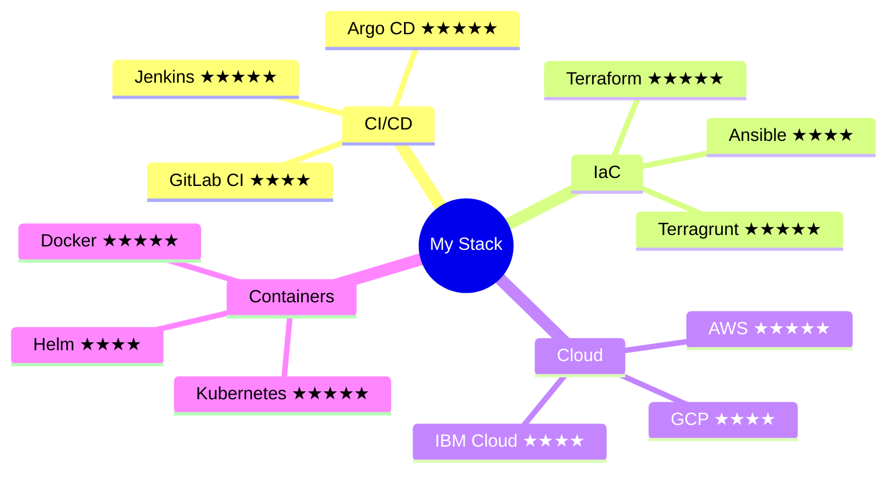
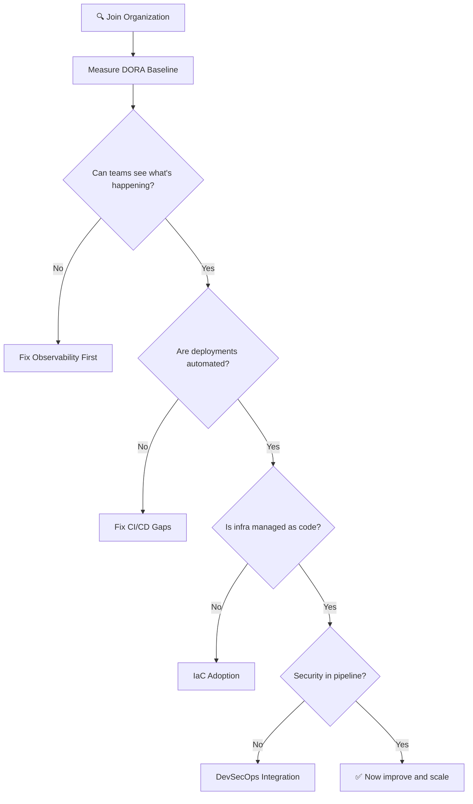
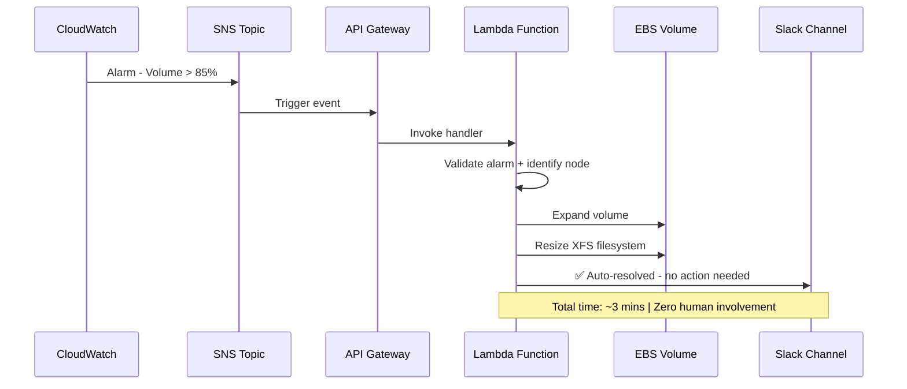
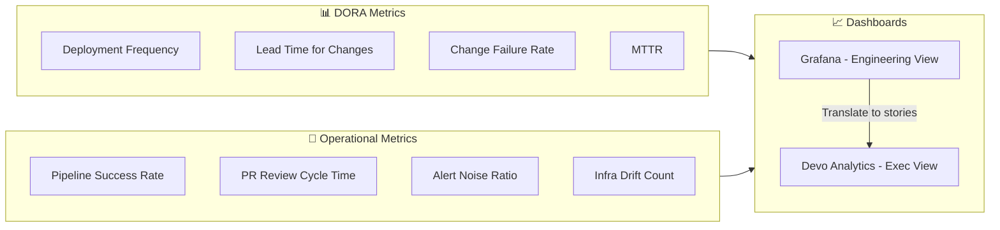
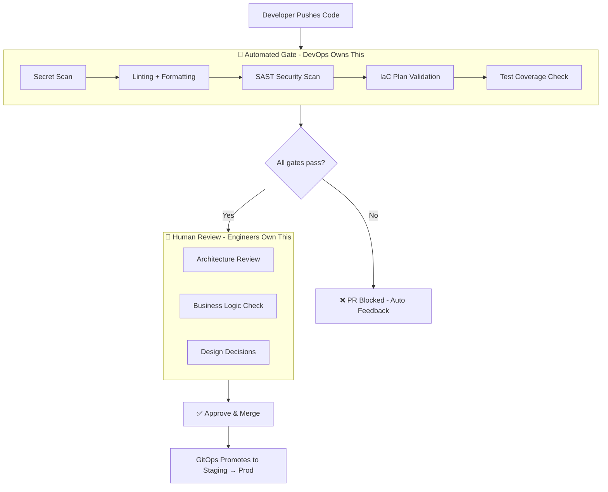
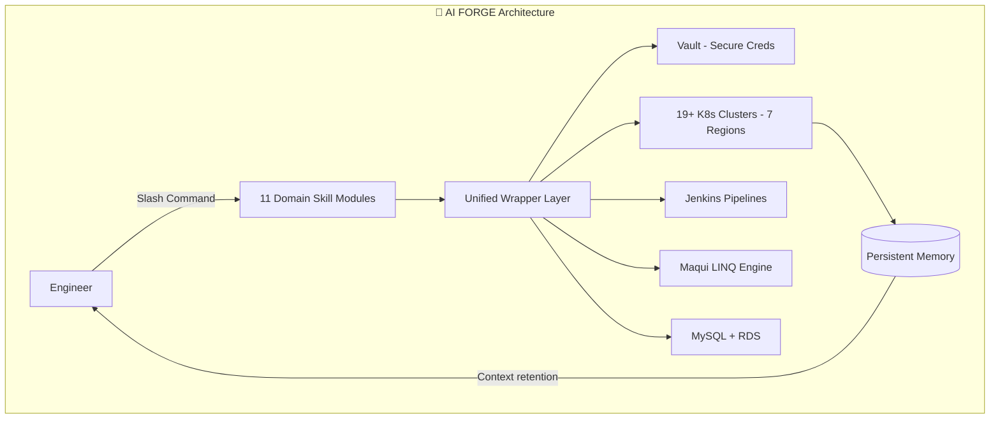
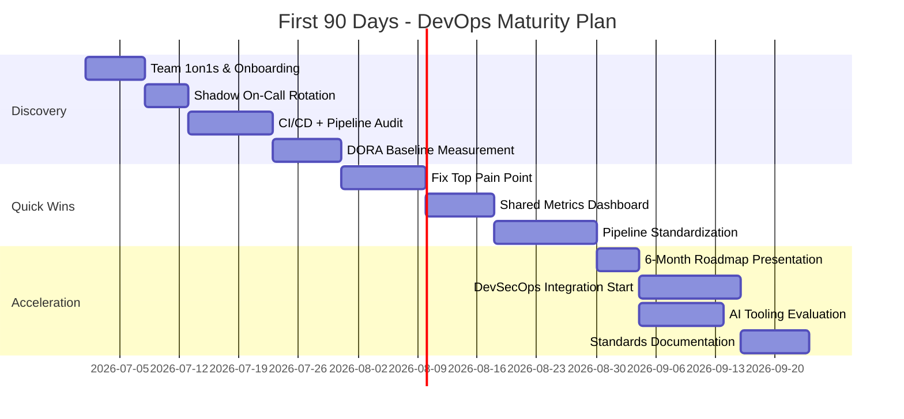

# Pre-Interview Questionnaire — Vikash Jaiswal
**Role:** Senior DevOps Engineer | Icreon | June 2026

---

## Q1. Describe the most significant DevOps transformation you have led.

When I joined Devo as CloudOps in April 2023, the situation was messy — 19+ Kubernetes clusters across 7 global regions, hundreds of EC2 data nodes, and engineers constantly re-explaining the same platform context every single incident. Tools existed but nothing was connected. Alerts were noisy, deployments were manual, and every new engineer needed weeks just to feel confident.

I fixed this in three phases. First, I built a centralized observability layer (Prometheus + OpenTelemetry + Grafana) with GitOps-managed alert configs — so alerts were code, not chaos. Second, I standardized all infrastructure with Terraform and Terragrunt across APAC, EU, and US — one change, three regions, same result every time. Third, I designed and built **AI FORGE** — a Claude AI-powered operational brain trained on Devo's entire platform architecture, so any engineer could debug Kubernetes, generate LINQ queries, or get runbook guidance instantly, without seeing a single raw credential.

Result? Troubleshooting time down ~60%, storage incidents went from 45-minute manual pages to 3-minute zero-touch automation, and new engineers became productive in days instead of weeks.

---

## Q2. What CI/CD, cloud, and IaC technologies have you worked with?

My strongest areas are **Terraform/Terragrunt** (including writing custom providers from scratch using the Plugin SDK — not just configuring existing ones), **Jenkins with Groovy shared libraries**, and **Argo CD** for GitOps-driven Kubernetes deployments. On cloud, AWS is where I've spent the most time — 7+ years across production workloads from broadcast streaming to GenAI platforms. I work in GCP and IBM Cloud too because Devo runs across all three, so single-cloud was never an option for me.

If I had to pick my top three: Terraform for infrastructure, Jenkins for pipelines, and Kubernetes for everything that runs on top.

---

## Q3. How do you evaluate DevOps maturity? What do you assess first?

I start with two questions: *How often does this team deploy to production?* and *When something breaks in prod, how long does it take to fix?* Those two numbers — deployment frequency and MTTR — tell me more about engineering health than any tool audit could. I use the DORA four-key metrics as my baseline because they're objective, industry-benchmarked, and don't lie.

From there I look at observability quality and CI/CD automation coverage. I've seen teams with Kubernetes everywhere still SSH-ing into boxes to make changes — that's the real maturity signal. Security integration and IaC adoption come next, but only after I understand the delivery baseline.

---

## Q4. Describe a deployment process you improved.

At Devo, EBS storage filling up on data nodes was one of the most common incidents in our on-call rotation. The fix was simple but the process wasn't — an engineer had to be paged, SSH in, manually expand the EBS volume, then resize the XFS filesystem. Every single time. 30-45 minutes of someone's night, for something completely predictable.

I rebuilt the entire response as event-driven automation. CloudWatch detects the threshold → SNS fires → API Gateway triggers a Lambda that validates the alarm, identifies the right node, expands EBS, resizes XFS, and posts a Slack message saying it's already resolved. Engineers only find out after it's done. Zero manual steps.

---

## Q5. What metrics do you use to measure delivery performance?

I use DORA's four metrics as the foundation: **Deployment Frequency** (how often we ship), **Lead Time for Changes** (commit to production), **Change Failure Rate** (how often a deployment causes an incident), and **MTTR** (how fast we recover). These four numbers give a clear picture of both speed and stability.

On top of DORA, I track PR review cycle time, pipeline success rate, and alert noise ratio. At Devo, I built Grafana dashboards that pulled from Prometheus and streamed infra data into Devo's own analytics platform — giving leadership real-time visibility into deployment health and incident trends. One thing I've learned: executives don't want percentages, they want stories. *"6 deployments failed last month, here's why, here's the fix"* gets action. A number doesn't.

---

## Q6. What role should DevOps play in PR reviews and release approvals?

DevOps should own the **automated checks layer** — the stuff that doesn't need a human brain. Secret scanning, linting, SAST, Terraform plan review, test coverage thresholds — all of this should automatically block a PR before any engineer even opens it. When a reviewer has to manually check for hardcoded passwords, that's automation failing to do its job.

At Devo, I made every configuration change (alert thresholds, routing rules, deployment params) go through a Git PR with CI validation and a full audit trail. The PR *was* the governance mechanism. No separate approval tool, no email chains — just Git. That's the standard I'd bring to Icreon.

---

## Q7. Describe your Kubernetes and cloud-native experience.

At Devo, I manage 19+ Kubernetes clusters across 7 global regions (EU, US, US3, APAC, NCSC, Santander). Argo CD handles all GitOps-driven deployments, Helm manages packaging, and Jenkins pipelines feed into the Kubernetes deploy workflow. AI FORGE itself runs as a containerized platform on EKS, with OpenBao/Vault for secrets and full multi-region failover support.

Before Devo, at Tata Sky I built containerized VoD pipelines using Lambda Step Functions, MediaLive, and MediaPackage — cloud-native video delivery for 450+ live TV channels on Akamai CDN. That's where I learned what "high availability" really means — when a container fails and a million people lose their TV, you fix it fast.

---

## Q8. How have you incorporated security into CI/CD?

The first big thing I did at Devo was kill all hardcoded credentials and environment variable secrets. Everything went through OpenBao/Vault — every Jenkins pipeline, every Kubernetes service account, every application. Full access logging. If you can't audit who accessed what secret and when, you don't have a security posture, you have an assumption.

Inside AI FORGE, I built a governance layer that requires explicit human sign-off before any destructive operation — no AI-triggered deletions, no bulk config changes without approval. For the Production RAG system, the AI Gateway handles AuthN/AuthZ, PII redaction before data hits the LLM, and content guardrails. Security for me isn't a step in the pipeline — it *is* the pipeline.

```mermaid
flowchart LR
    subgraph CODE["💻 Code Commit"]
        C1[Pre-commit: Secret Scan]
        C2[Branch Protection Rules]
    end

    subgraph CI["⚙️ CI Pipeline"]
        CI1[SAST - Code Vulnerabilities]
        CI2[SCA - Dependency CVE Scan]
        CI3[Container Image Scan]
        CI4[IaC Policy Validation]
    end

    subgraph DEPLOY["🚀 Pre-Deploy"]
        D1[Vault - Secrets Injection]
        D2[K8s RBAC Enforcement]
        D3[Approval Gate for Prod]
    end

    subgraph RUNTIME["🔒 Runtime"]
        R1[Anomaly Detection via Observability]
        R2[Audit Trail - GitOps]
        R3[PII Redaction - AI Gateway]
    end

    CODE --> CI --> DEPLOY --> RUNTIME
```

---

## Q9. How do you see AI changing DevOps? Have you built any AI tools?

I didn't just evaluate AI tools — I built one in production. AI FORGE at Devo was designed to solve a real problem: onboarding into a 19+ cluster, 7-region, 11-domain platform took weeks. AI FORGE gave every engineer an AI assistant that already knew the entire infrastructure — Kubernetes debug flows, LINQ query patterns, Vault secret paths, incident runbooks — all in one place, with no credential exposure and with governance controls built in.

I'm also currently doing a 12-day GenAI architect crash course (RAG, Vector DBs, LangGraph, Agents, MCP) and I've designed a Production RAG system that routes queries across Claude, Gemini, OpenAI, and Groq based on cost and latency — with LLM-level observability through Langfuse. The way I see it: AI won't replace DevOps engineers. But DevOps engineers who can build AI-powered operational systems will replace those who can't. I'm already building.

---

## Q10. What would your first 90 days look like?

**Days 1–30: Listen and measure.** I don't touch anything. I do 1:1s with every team lead, shadow an on-call rotation, audit existing pipelines, and measure the DORA baseline. By day 30, I know exactly where the biggest problems are — not from assumptions, but from data.

**Days 31–60: Fix the biggest pain point.** Usually it's one of two things — teams can't see what's happening in their systems (observability gap), or things work on staging and break in prod (deployment consistency). I also set up a shared metrics dashboard visible to everyone, not just leadership. Engineers who can see their own delivery data fix it themselves.

**Days 61–90: Build the roadmap.** I present a 6-month DevOps maturity plan, introduce a standards document for CI/CD and IaC, begin DevSecOps integration, and evaluate AI tooling opportunities. By day 90, every team should have at least one fewer manual process and full visibility into how they're performing.

---

*Vikash Jaiswal | vikashjaiswal.486@gmail.com | +91-8588800287*
*github.com/vikas0486 | AI FORGE: https://github.com/vikas0486/AI-Forge
